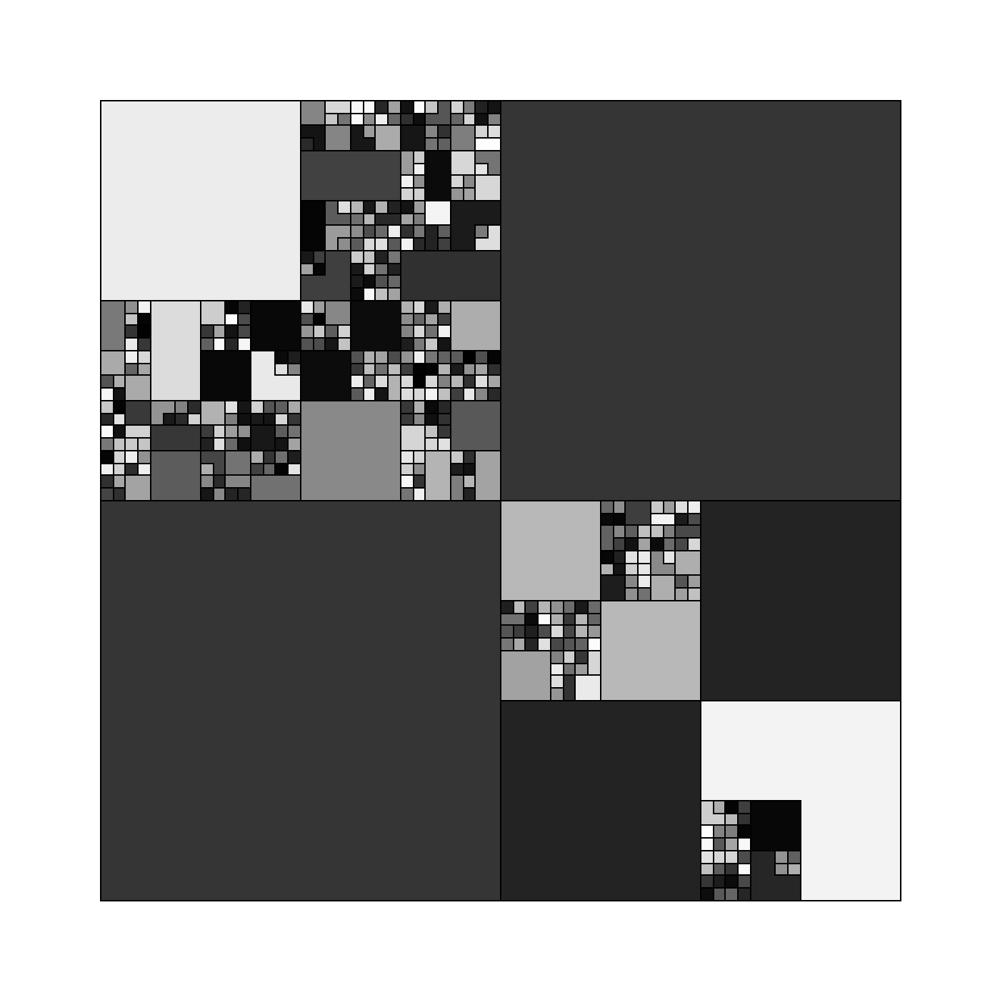
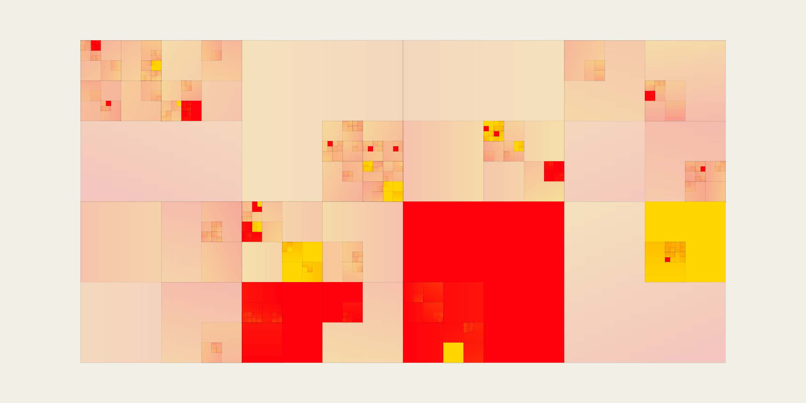
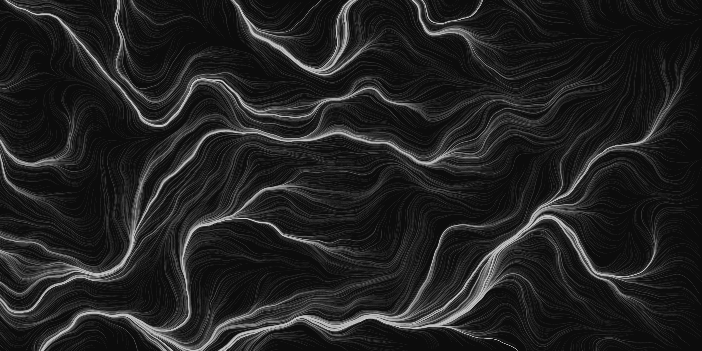
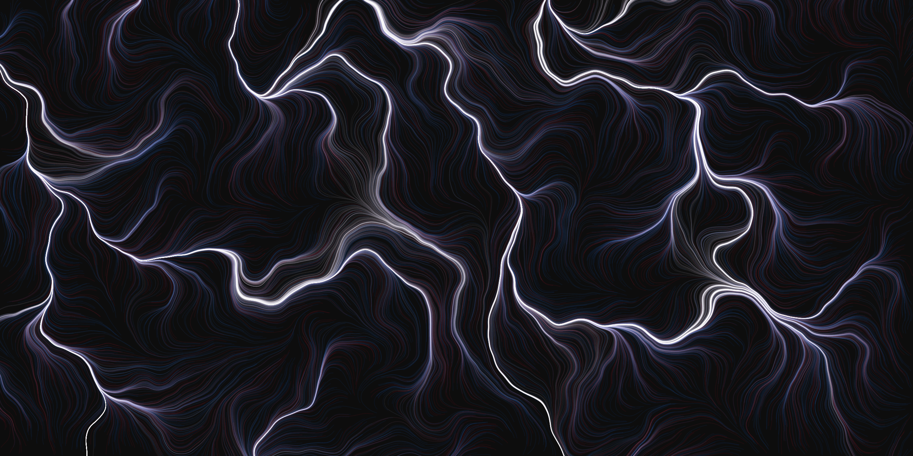
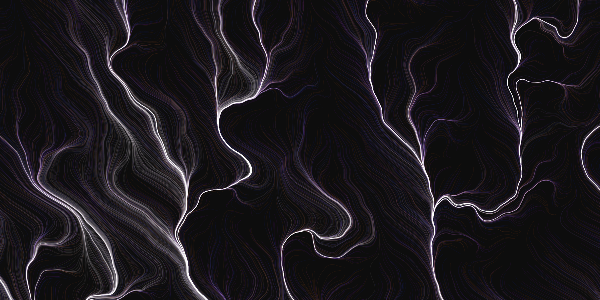

# ジェネラティブアート制作のアイディア
どんなに高度なアルゴリズムを実装できたとしても、ビジュアルが悪ければ見る人を魅了する作品にはならない。  
逆に、アルゴリズムが単純でも見せ方がうまければ多くの人を魅了する作品になる。

アルゴリズムのみでビジュアルは意識していない


ビジュアルのクオリティを高めたもの


アルゴリズムのみでビジュアルは意識していない


ビジュアルのクオリティを高めたもの



私[(@P5Aholic)](https://twitter.com/p5aholic)がこれまでジェネラティブアートを作ってきた経験から得た、作品のビジュアルのクオリティを高める考え方や、1つのプログラムから多様なアウトプットを生み出すテクニックを共有します。

# Sample1 : Step1
基本アルゴリズムの実装から線に濃淡を作るまでを実装する。

[Sample1](https://github.com/p5aholic/pcd-tokyo/tree/master/samples/sample1_particle_step1)



## アルゴリズム概要
パーティクルを画面上にランダムに配置し、座標からノイズ値を計算、さらにそのノイズ値から速度を作りパーティクルを動かす

## Particleクラスの作成
**Particle.pde**
```java
class Particle {
  float x, y;        // 座標
  float speed;       // 速さ
  color strokeColor; // 線の色

  Particle() {
    // 初期値の設定
    x = random(width);
    y = random(height);
    speed = 1.0;
    strokeColor = color(0, 0, 100);
  }

  // 座標更新
  void update() {
    // 現在の座標からノイズ値を得る
    float n = noise(x * noiseScale, y * noiseScale);
    // ノイズ値を元に角度を計算
    float angle = angleAmplitude * n;
    // 角度から速度を計算
    float vx = speed * cos(angle);
    float vy = speed * sin(angle);
    // 次の座標 = 現在の座標 + 速度
    x += vx;
    y += vy;
  }

  // 頂点の追加
  void addVertex() {
    stroke(strokeColor);
    vertex(x, y);
  }
}
```

## ArrayList
複数のパーティクルの管理に`ArrayList`を使う

配列の初期化
```java
ArrayList<Particle> particles = new ArrayList<Particle>();
int numParticles = 1000;
```

配列に要素を追加する
```java
// rを押すたびに実行されるので、まず配列を空にする
particles.clear();
for (int i = 0; i < numParticles; i++) {
  particles.add(new Particle());
}
```

ループ処理
```java
for (Particle p : particles) {
  p.update();
  p.addVertex();
}
```

## beginShape(), vertex(), endShape()
`point()`で点を描画する場合
```java
for (Particle p : particles) {
  stroke(p.strokeColor);
  point(p.x, p.y);
}
```

これでもいいが、`beginShape(POINTS)`を使うほうが高速
```java
beginShape(POINTS);
for (Particle p : particles) {
  stroke(p.strokeColor);
  vertex(p.x, p.y);
}
endShape();
```

内部的に`point()`は`beginShape(POINTS), vertex(), endShape()`の呼び出しで実装されている。

## noiseSeed()
`noise()`で計算される値のもとになる**シード値**を設定する。  
**シード値**が同じなら`noise()`は毎回同じ値になる  
[noiseSeed_test](https://github.com/p5aholic/pcd-tokyo/tree/master/samples/noiseSeed_test)
```java
// シード値を1000で固定する
noiseSeed(1000);
println(noise(0));
println(noise(1));
println(noise(2));

println("--------");

// シード値をランダムに設定する
int seed = (int)random(10000);
noiseSeed(seed);
println(noise(0));
println(noise(1));
println(noise(2));
```

## 線に濃淡を作る
パーティクルの透明度を下げることによって、線に濃淡を作る

```java
strokeColor = color(0, 0, 100, 8);
```

1つのパーティクルの透明度を下げた分画面の密度が下がるので、パーティクル数を上げておく
```java
int numParticles = 10000; // パーティクルの数
```

濃淡が生まれたことでパーティクルの流れがより明確になり、静止画から時間の流れを感じられるようになった。

# Sample1 : Step2
ランダムなカラーパレットを作り、パーティクルの色により複雑な変化を与える。

[Sample1](https://github.com/p5aholic/pcd-tokyo/tree/master/samples/sample1_particle_step2)



更新回数を表すint型変数`updateCount`を用意。
```java
int updateCount;

void reset() {
  updateCount = 0;
}

void draw() {
  updateCount++;
}
```

ランダムに設定される3色のカラーパレットを作る
```java
int[] palette = new int[3];

// パレットをランダムに設定
for (int i = 0; i < palette.length; i++) {
  palette[i] = (int)random(360);
}
```

カラーパレットから1色を選ぶようにする  
**Particle.pde**
```java
int hue; // 色調

hue = palette[(int)random(palette.length)];
```

パーティクルの色を徐々に白に近づける  
**Particle.pde**
```java
float sat = 100 - updateCount * 0.4; // 彩度を徐々に100から0に
strokeColor = color(hue, sat, 100, 8);
```

# Sample1 : Step3
パーティクルの動きにパターンを増やし、1つのプログラムから多様なアウトプットを生み出せるシステムを作る。

[Sample1](https://github.com/p5aholic/pcd-tokyo/tree/master/samples/sample1_particle_step3)




## `noise()`の復習
[noise_basic](https://github.com/p5aholic/pcd-tokyo/tree/master/samples/noise_basic)  
[noise_basic_2d](https://github.com/p5aholic/pcd-tokyo/tree/master/samples/noise_basic_2d)  
[noise_angle](https://github.com/p5aholic/pcd-tokyo/tree/master/samples/noise_angle)

## パラメータの乱数化
ノイズの振幅と角度の初期値をランダムに設定。  
`noise()`は0〜1の値を返すが、中央の0.5付近に偏りがあるので、`startAngle`でパーティクルの進行方向の偏りを解消する。
```java
float angleAmplitude;
float startAngle;

void reset() {
  angleAmplitude = random(3, 12);
  startAngle = random(TWO_PI);
}
```

**Particle.pde**
```java
float angle = startAngle + angleAmplitude * n;
```

## ノイズ値を変形させる
パーティクルの座標計算に別パターンを作る
```java
int mode = 1; // 1 or 2

void keyPressed() {
  switch(key) {
    case 'r': reset(); break;
    case 's': saveFrame("frames/####.png"); break;
    case '1': mode = 1; reset(); break;
    case '2': mode = 2; reset(); break;
  }
}
```

**Particle.pde**
```java
if (mode == 2) {
  n = ceil(n * 6.0) / 6.0;
}
```

`ceil()`は小数点以下を切り上げする関数。  
`ceil(n * 6.0)` で`n`の値が**1.0, 2.0, 3.0, 4.0, 5.0, 6.0**の6つの値になる。  
それを6.0で割ることで、0~1の間で値が6つに区切られる。
```
n = ceil(n * 6.0) / 6.0;
```

好みによるが、`pow()`でノイズ値の曲線を急にすることで味わいが出る。
```java
n = pow(n, 3);
```

`n = pow(n, 3)`は`n = n * n * n`と同等。もともとの`n`が小さいほどより小さくなり、`n`の値がより極端になる。

```
nが0.8の場合 : 0.8 * 0.8 * 0.8 = 0.512
nが0.2の場合 : 0.2 * 0.2 * 0.2 = 0.008
```
