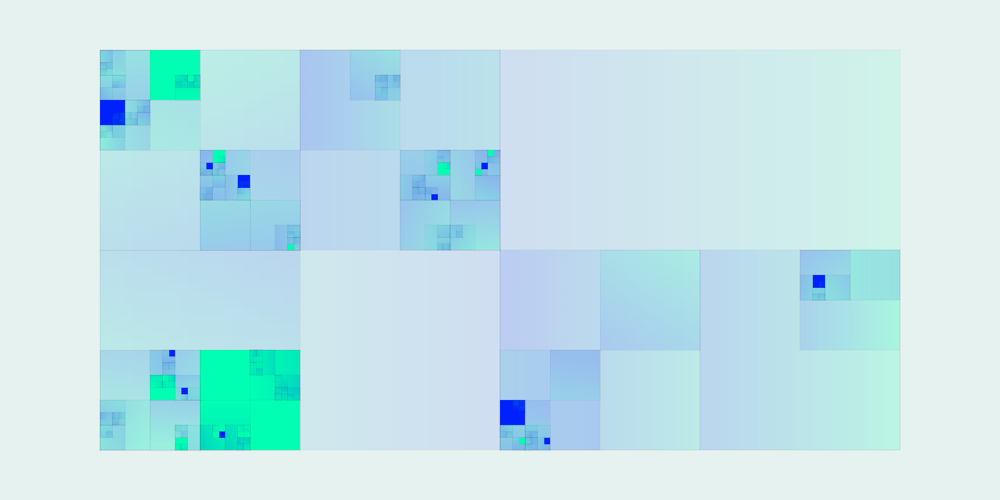

# Sample2 : Step1
基本アルゴリズムを実装する。

[Sample2_1](https://github.com/p5aholic/pcd-tokyo/tree/master/samples/sample2_rectangles_step1)


## アルゴリズム概要
正方形を4分割する処理をある程度の小ささになるまで再帰的に繰り返す。

正方形の最小サイズと最大サイズを設定する。
```java
float minSize, maxSize;

minSize = 5;
maxSize = height * 0.8;
```

画面中心から最大サイズで分割を開始する。
```java
branch(width/2, height/2, maxSize);
```

`branch()`の中ではまず現在の座標とサイズで正方形を描く。
```java
strokeWeight(1);
stroke(0, 0, 0);
fill(0, 0, random(100));
rect(cx, cy, size, size);
```

正方形を4分割するので`size`を半分にしておく。
```
size *= 0.5;
```

`branch`関数の中で`branch()`を呼び出す**再帰処理**で分岐を行う。
分岐の終了処理を書いていないと無限ループが発生してプログラムがクラッシュするので注意。
```java
// 最小サイズ未満なら分岐を終了
if (size < minSize) return;

// 1分岐ごとに65%の確率で4分岐する
float P = 0.65;

if (random(1) < P) {
  branch(cx-size/2, cy-size/2, size); // 左上
}
if (random(1) < P) {
  branch(cx+size/2, cy-size/2, size); // 右上
}
if (random(1) < P) {
  branch(cx+size/2, cy+size/2, size); // 右下
}
if (random(1) < P) {
  branch(cx-size/2, cy+size/2, size); // 左下
}
```

# Sample2 : Step2
配色を工夫する。

[Sample2_2](https://github.com/p5aholic/pcd-tokyo/tree/master/samples/sample2_rectangles_step2)


正方形分割を左右に2つ並べる。
```java
branch(width/2 - maxSize/2, height/2, maxSize);
branch(width/2 + maxSize/2, height/2, maxSize);
```

ランダムな2色のカラーパレットを作り、背景色はカラーパレットから1色を選ぶようにする。
```java
int numPalette = 2;
int[] palette = new int[numPalette];
```

```java
changeColor();
background(getRandomPalette(), 5, 90);
```

```java
void changeColor() {
  for (int i = 0; i < numPalette; i++) {
    palette[i] = (int)random(360);
  }
}
```

90％の確率で薄い色、10％の確率でビビッドな色を選ぶようにする。
```java
if (random(1) < 0.9) {
  fill(getRandomPalette(), 100, 100, 10);
} else {
  fill(getRandomPalette(), 100, 100);
}
rect(cx, cy, size, size);
```

# Sample2 : Step3
グラデーションを使用しビジュアルに複雑さを足す。

[Sample2_3](https://github.com/p5aholic/pcd-tokyo/tree/master/samples/sample2_rectangles_step3)



`P2D`レンダリングモードは内部で`OpenGL`を使用しているため、頂点に別々の色を指定することでグラデーションが作れる。
[gradation](https://github.com/p5aholic/pcd-tokyo/tree/master/samples/gradation)
```java
// 上から下へのグラデーション
beginShape();
fill(random(360), 100, 100);
vertex(-size/2, -size/2);
vertex(+size/2, -size/2);

fill(random(360), 100, 100);
vertex(+size/2, +size/2);
vertex(-size/2, +size/2);
endShape(CLOSE);
```

ランダムに回転処理を加えることで、グラデーションの方向を変える
```java
void drawGradationRect(float cx, float cy, float size) {
  // 90度、180度、270度のどれかで回転する
  pushMatrix();
  translate(cx, cy);
  int r = (int)random(4);
  rotate(r * HALF_PI);

  // グラデーションする長方形を描く
  beginShape();
  strokeWeight(1);
  stroke(0, 0, 0, 5);
  fill(palette[0], 100, 100, 10);
  vertex(-size/2, -size/2);
  vertex(+size/2, -size/2);

  fill(palette[1], 100, 100, 10);
  vertex(+size/2, +size/2);
  vertex(-size/2, +size/2);
  endShape(CLOSE);

  popMatrix();
}
```